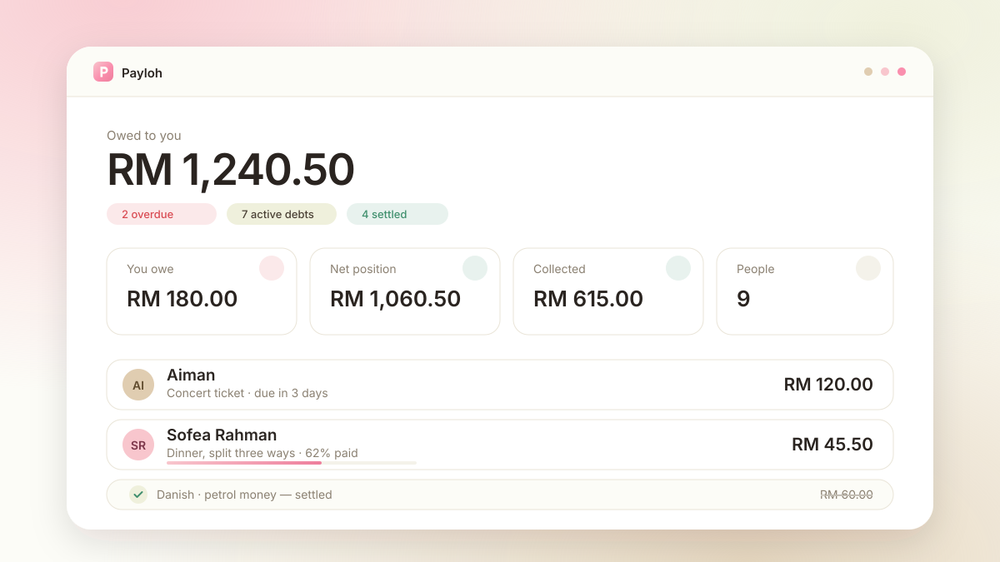

<div align="center">

# Payloh — track who owes you what

**Debt ledger for friends · part-payments · due dates · WhatsApp reminders**
A quiet little book for the money that moves between people who'd rather not ask twice.

[](https://kymy07.github.io/PayLoh/)
[](https://github.com/kymy07/PayLoh/actions)
[](https://vite.dev/)

### 🔗 **[kymy07.github.io/PayLoh](https://kymy07.github.io/PayLoh/)**



</div>

---

## Overview

Payloh keeps a private ledger of what friends owe you — and what you owe them.
Log a debt, record instalments as they trickle back, and let the app draft the
awkward reminder so you don't have to write it.

Everything is scoped to your own account. Nobody else can see your ledger, not
even other Payloh users.

The visual identity is a **warm swatch palette** — sand, linen, cream, blush,
pink and rose — mapped onto Apple's calmer habits: system type set tight at
display sizes, translucent chrome, spring easing, and generous whitespace.

---

## Features

| | |
|---|---|
| 🔐 **Two ways in** | Email/password and Google sign-in, with password reset |
| ↔️ **Both directions** | Track what people owe you *and* what you owe them, netted into one position |
| 💸 **Part-payments** | RM100 lent, RM30 back today — the balance and instalment history keep themselves straight |
| 📅 **Due dates** | A live countdown per debt; anything overdue floats to the top of the dashboard |
| 📊 **Dashboard** | Hero balance, four stat tiles, and a ranked chart of who owes the most |
| 💬 **Drafted reminders** | A friendly message with the amount and reason, editable, one tap into WhatsApp |
| 👥 **Per-person totals** | Names are saved once and reused from a picker; each person gets a page with their running total across every debt |
| 🔍 **Find anything** | Search by name or reason, filter by state, sort by balance, due date or name |
| 🌗 **Light & dark** | Follows your system unless you pick a side; no flash on load |
| 📱 **Mobile-first** | iOS-style tab bar and a floating compose button below `md` |
| 🔒 **Locked per account** | Database rules key every node to its owner's uid — cross-account reads are denied outright |

---

## Routes

| Route | Contents |
|---|---|
| `/` | Landing page — hero, features, how it works |
| `/login` · `/signup` | Auth screens with a Firebase setup notice when unconfigured |
| `/app` | Dashboard — hero figure, stat tiles, overdue list, top-debtors chart |
| `/app/debts` | Full ledger — search, five filters, four sort orders |
| `/app/debts/:debtId` | One debt — balance, progress, payment history, all actions |
| `/app/people` | Everyone you've lent to, ranked by net position |
| `/app/people/:personKey` | One person — net headline, every debt with them, prefilled new debt |
| `/app/settings` | Profile, currency, theme, ledger summary, sign out |

---

## Tech Stack

**Frontend** — React 19 · TypeScript · Vite 7 · React Router 7
**Styling** — Tailwind CSS v4 · shadcn/ui (new-york) · Radix primitives · Lucide icons
**Charts** — Recharts
**Backend** — Firebase Authentication · Firebase Realtime Database
**Hosting** — GitHub Pages (Actions) · Firebase Hosting

One build, two homes: `VITE_BASE_PATH` sets the asset prefix and the router
reads `import.meta.env.BASE_URL`, so the same source serves a subpath or a root
domain without a change.

---

## Project Structure

```
PayLoh/
├── .github/workflows/
│   └── deploy-pages.yml      # build dist/ and publish to Pages
├── database.rules.json       # per-account access rules
├── firebase.json             # database rules + hosting config
├── .env.example              # config template — no real keys
├── docs/preview.svg          # README banner
└── src/
    ├── components/
    │   ├── ui/               # shadcn primitives (button, dialog, select, …)
    │   ├── AppShell.tsx      # header, nav, mobile tab bar
    │   ├── DebtCard.tsx      # one debt in a list
    │   ├── DebtDialog.tsx    # add / edit a debt
    │   ├── PaymentDialog.tsx # record an instalment
    │   ├── ReminderDialog.tsx# draft + WhatsApp handoff
    │   └── TopPeopleChart.tsx
    ├── contexts/
    │   ├── AuthContext.tsx   # session, profile, sign-in/out
    │   ├── ThemeContext.tsx  # light / dark / system
    │   └── DebtActionsContext.tsx  # owns every debt dialog in one place
    ├── hooks/useDebts.ts     # live subscriptions + all writes
    ├── lib/
    │   ├── firebase.ts       # SDK init + config guard
    │   ├── types.ts          # Debt / Payment shapes, derived status
    │   ├── format.ts         # money, dates, initials, avatar tints
    │   └── reminder.ts       # message builder, WhatsApp link
    ├── pages/                # Landing, Login, Signup, Dashboard, Debts, …
    └── index.css             # palette + design tokens
```

---

## Getting Started

```bash
git clone https://github.com/kymy07/PayLoh.git
cd PayLoh
npm install
npm run dev
```

Then open <http://localhost:5173/>.

> **It runs before Firebase is configured.** The landing page works as-is; the
> auth screens show a setup notice instead of a confusing error until you paste
> your keys.

| Script | What it does |
|---|---|
| `npm run dev` | Dev server with hot reload |
| `npm run build` | Type-check, then build to `dist/` |
| `npm run preview` | Serve the production build locally |
| `npm run deploy` | Build and push to Firebase Hosting |

---

## Firebase Setup

Copy `.env.example` to `.env.local` and fill in the three `PASTE_` values from
**Project settings → Your apps → Web app**. Then publish `database.rules.json`
from the Realtime Database **Rules** tab.

**→ Full walkthrough in [SETUP.md](SETUP.md).**

> `.env.local` is gitignored and never leaves your machine. `.env.example` is the
> committed template and holds no real keys. The four public identifiers
> (project ID, database URL, auth domain, storage bucket) appear in every
> Firebase web bundle — what actually protects your data is `database.rules.json`.

---

## Deployment

### GitHub Pages

Every push to `main` triggers `.github/workflows/deploy-pages.yml`, which builds
`dist/` and publishes it. Its `configure-pages` step also sets the repo's Pages
source to **GitHub Actions**, so the site can't silently fall back to serving
unbuilt source.

Two one-time settings remain:

1. **Settings → Secrets and variables → Actions** — add `VITE_FIREBASE_API_KEY`,
   `VITE_FIREBASE_MESSAGING_SENDER_ID`, `VITE_FIREBASE_APP_ID`. `.env.local` is
   gitignored, so the runner can't read it; that's the point.
2. **Firebase → Authentication → Settings → Authorised domains** — add
   `kymy07.github.io`, or sign-in fails with `auth/unauthorized-domain`.

```bash
git add -A
git commit -m "your message"
git push origin main
```

### Firebase Hosting

```bash
npm install -g firebase-tools
firebase login
npm run deploy
```

---

## Editing Guide

<details>
<summary><b>The data model</b></summary>

```
users/{uid}
  uid, displayName, email, photoURL, currency, createdAt

debts/{uid}/{debtId}
  ownerId, personName, personPhone
  direction   'owed_to_me' | 'i_owe'
  amount      total agreed
  paid        running total of instalments
  currency, description, dueDate, settledAt, createdAt, updatedAt
  payments/{paymentId}
    amount, note, paidAt, createdAt
```

Two things this shape buys:

- **Debts sit under the owner's uid**, so the rules are one line per subtree and
  there's no query to filter — the subtree *is* your ledger.
- **Payments nest inside the debt**, so a single transaction updates the
  instalment and the `paid` total together. They can't drift apart, even with
  the app open in two tabs.

All timestamps are epoch milliseconds — Realtime Database has no date type.

</details>

<details>
<summary><b>Changing the palette</b></summary>

Every colour is a CSS custom property in `src/index.css`. The swatch sits at the
top of `:root`:

```css
--payloh-sand:  #C9AF87;
--payloh-linen: #E0CDB1;
--payloh-cream: #EFF0DC;
--payloh-blush: #F8C6CD;
--payloh-pink:  #FA8FAE;
--payloh-rose:  #EE7E9C;
```

Below it, those feed shadcn's semantic tokens (`--primary`, `--accent`,
`--muted`, …), which every component reads. Change the swatch and the whole app
follows. `.dark` redefines the same tokens — it's a chosen palette, not an
inverted one.

</details>

<details>
<summary><b>The dashboard chart colours</b></summary>

The chart plots one series, so it uses one hue — `--chart-bar`, a deeper step of
the brand rose. Light and dark each get their own step rather than sharing one:

```css
:root  { --chart-bar: #d9557a; }
.dark  { --chart-bar: #d65c84; }
```

Both were checked against the OKLCH lightness band, a chroma floor, and 3:1
contrast versus their own surface — not picked by eye. If you swap them, keep
light within L 0.43–0.77 and dark within L 0.48–0.67.

</details>

<details>
<summary><b>Adding a currency</b></summary>

Append to `CURRENCIES` in `src/lib/format.ts`:

```ts
{ code: "THB", label: "Thai Baht", symbol: "฿" },
```

It appears in Settings immediately. Amounts format through `Intl.NumberFormat`,
so nothing else needs touching. Existing debts keep the currency they were
logged in — changing the default only affects new ones.

</details>

<details>
<summary><b>The reminder message</b></summary>

`buildReminderMessage()` in `src/lib/reminder.ts` assembles it line by line —
greeting, reason, due status, how much is already paid, sign-off. The dialog
shows the draft in a textarea, so anything you change there is what gets sent.

`normalisePhone()` handles Malaysian numbers: `012-345 6789` becomes
`60123456789` for the `wa.me` link.

</details>

---

## Contact

[](mailto:adlishah0821@gmail.com)
[](https://www.linkedin.com/in/adlishah-hakimi-56325223a/)
[](https://github.com/kymy07)
[](https://wa.me/60189437671)

---

<div align="center">

**Adlishah Hakimi bin Sharilfuddin** · Malaysia

</div>
